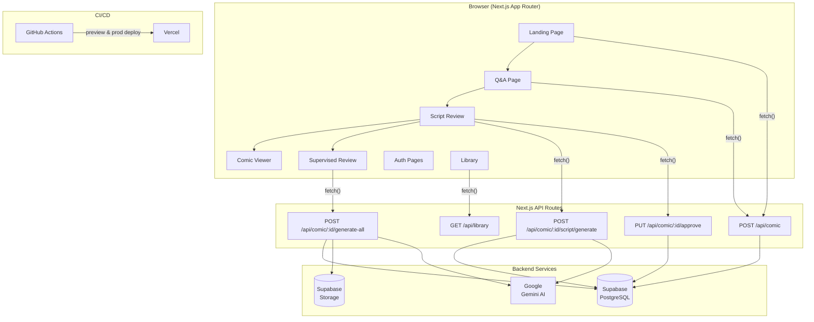
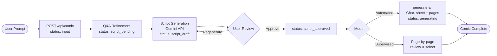

# Comicly

AI-powered comic book generator — turn any story idea into a fully illustrated comic strip.

[](https://github.com/Reghunaath/comicly/actions/workflows/ci.yml)
[](https://comicly.vercel.app)

**Live demo:** https://comicly.vercel.app

---

## Features

- **AI script generation** — Gemini crafts a full comic script (title, synopsis, characters, panels, dialogue) from your prompt
- **Follow-up Q&A refinement** — targeted questions deepen the story before the script is written
- **Supervised & automated modes** — review and approve each page individually, or generate everything in one shot
- **Multimodal image generation** — character reference sheet + previous page passed as context to Gemini for visual consistency
- **Page versioning** — regenerate any page up to 4 times and pick the best version
- **Guest mode** — no login required; comics can be claimed to an account after signup
- **Library** — authenticated users see all their comics in one place
- **PDF export & share link** — download a PDF or copy a public URL

---

## Architecture

### System overview



### Comic creation flow



---

## Tech stack

| Layer | Technology |
|---|---|
| Framework | Next.js 16 (App Router) |
| Frontend | React 19, Tailwind CSS v4 |
| Auth & DB | Supabase (PostgreSQL + Row-Level Security) |
| AI | Google Gemini (`@google/genai`) |
| Validation | Zod |
| Testing | Vitest, React Testing Library, MSW v2, Playwright |
| CI/CD | GitHub Actions, Vercel |

---

## Getting started

### Prerequisites

- Node.js 18+
- A [Supabase](https://supabase.com) project
- A [Google AI Studio](https://aistudio.google.com) API key

### Setup

```bash
git clone https://github.com/Reghunaath/comicly.git
cd comicly
npm install
cp .env.example .env.local   # then fill in the values below
npm run dev
```

Open [http://localhost:3000](http://localhost:3000).

### Environment variables

| Variable | Scope | Purpose |
|---|---|---|
| `NEXT_PUBLIC_SUPABASE_URL` | browser | Supabase project URL |
| `NEXT_PUBLIC_SUPABASE_ANON_KEY` | browser | Supabase anon key |
| `NEXT_PUBLIC_BASE_URL` | browser | App base URL (e.g. `http://localhost:3000`) |
| `NEXT_PUBLIC_USE_MOCK_API` | browser | `true` to use mock API (no real keys needed) |
| `SUPABASE_SERVICE_ROLE_KEY` | server only | Server-side Supabase operations |
| `GEMINI_API_KEY` | server only | Google Gemini image & text generation |

---

## Commands

```bash
npm run dev               # Start dev server at http://localhost:3000
npm run build             # Production build
npm run lint              # ESLint
npm run test              # Vitest unit & component tests
npm run test:coverage     # Vitest with coverage report (70% threshold)
npm exec playwright test  # Playwright E2E tests
```

---

## Project structure

```
src/
├── app/                  # Next.js routes & API handlers
│   ├── api/comic/        # REST API (create, script, approve, generate, library)
│   ├── auth/             # Login, signup, OAuth callback
│   ├── comic/[id]/       # Comic viewer
│   ├── create/           # Q&A refinement wizard step
│   ├── library/          # User comic library
│   ├── review/[id]/      # Supervised page review
│   └── script/[id]/      # Script review & approval
├── backend/
│   ├── handlers/         # Business logic (one file per endpoint)
│   └── lib/              # DB, AI, validation, Supabase helpers
└── frontend/
    ├── auth/             # Login & signup components
    ├── comic-viewer/     # Viewer page component
    ├── landing/          # Home page component
    ├── library/          # Library page component
    ├── qa/               # Q&A page component
    ├── script-review/    # Script review component
    └── lib/              # API client, types, auth helpers
```

---

## CI/CD pipeline

| Job | What it runs |
|---|---|
| Lint | ESLint |
| Type Check | `tsc --noEmit` |
| Unit Tests | Vitest with 70% coverage threshold |
| E2E Tests | Playwright on Chromium |
| Security | `npm audit` + Gitleaks secret scan |
| AI Code Review | Claude Code (C.L.E.A.R. framework) on every PR |

Every push to `main` triggers a production deploy to Vercel. Every PR gets a preview deploy.

---

## Team

Built by **Reghunaath** and **Qingyang** for the AI-Assisted Coding course (Spring 2026).
